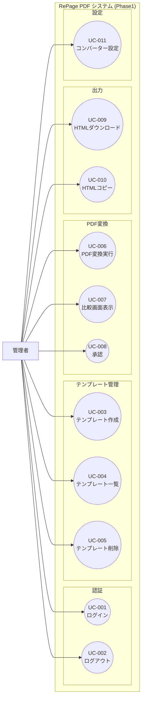
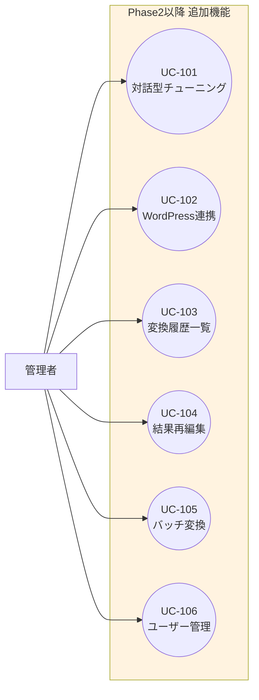

# ユースケース図

## 概要
RePage PDFシステムにおけるアクターとユースケースの関係を定義します。
Phase1（MVP）スコープと、Phase2以降の将来スコープを明確に区別して記載します。

## ステータス
- **フェーズ**: 要件定義
- **作成日**: 2025-12-12
- **更新日**: 2025-12-12
- **作成者**: Claude (AIPM)
- **レビュー状況**: 承認済み

---

## 内容

### アクター一覧

| アクター名 | 説明 | 権限レベル |
|------------|------|------------|
| 管理者 | システムの全機能を使用可能な唯一のユーザー | 全権限 |

※ Phase1では管理者ロールのみ。将来的に一般ユーザーロールの追加も検討可能。

### ユースケース一覧

#### Phase1: MVP スコープ

| UC-ID | ユースケース名 | アクター | 概要 | 優先度 |
|-------|----------------|----------|------|--------|
| UC-001 | ログイン | 管理者 | メールアドレスとパスワードでシステムにログイン | 必須 |
| UC-002 | ログアウト | 管理者 | システムからログアウト | 必須 |
| UC-003 | テンプレート作成 | 管理者 | テンプレート名と学習用URL3件を入力し、AIがサイトのコーディングルールを学習・生成 | 必須 |
| UC-004 | テンプレート一覧表示 | 管理者 | 作成済みテンプレートの一覧を表示 | 必須 |
| UC-005 | テンプレート削除 | 管理者 | 不要なテンプレートを削除 | 必須 |
| UC-006 | PDF変換実行 | 管理者 | テンプレートを選択し、PDFをアップロードしてHTML変換を実行 | 必須 |
| UC-007 | 比較画面表示 | 管理者 | PDFプレビューと生成HTMLを左右に並べて比較確認 | 必須 |
| UC-008 | 承認 | 管理者 | 変換結果を承認し、確定状態にする | 必須 |
| UC-009 | HTMLダウンロード | 管理者 | 生成されたHTMLコードをファイルとしてダウンロード | 必須 |
| UC-010 | HTMLコピー | 管理者 | 生成されたHTMLコードをクリップボードにコピー | 必須 |
| UC-011 | PDFコンバーター設定 | 管理者 | 使用するPDFコンバーターエンジンを選択・設定 | 必須 |

#### Phase2以降: 将来スコープ

| UC-ID | ユースケース名 | アクター | 概要 | 優先度 |
|-------|----------------|----------|------|--------|
| UC-101 | 対話型チューニング | 管理者 | 生成されたHTMLに対してチャットで修正指示を出し、AIが再生成 | 高 |
| UC-102 | WordPress API連携 | 管理者 | 生成HTMLをWordPressサイトに直接投稿 | 高 |
| UC-103 | 変換履歴一覧 | 管理者 | 過去の変換結果を一覧表示 | 中 |
| UC-104 | 変換結果再編集 | 管理者 | 保存済みの変換結果を再度編集 | 中 |
| UC-105 | バッチ変換 | 管理者 | 複数PDFを一括で変換処理 | 中 |
| UC-106 | ユーザー管理 | 管理者 | 複数ユーザーの追加・編集・削除 | 低 |

### ユースケース図

#### Phase1: MVP スコープ

#### Phase2以降: 将来スコープ

### ユースケース詳細

#### UC-003: テンプレート作成

| 項目 | 内容 |
|------|------|
| **アクター** | 管理者 |
| **事前条件** | ログイン済み |
| **トリガー** | テンプレート作成画面を開く |
| **基本フロー** | 1. テンプレート名を入力 2. 学習用URL 3件を入力 3. 「学習開始」ボタンをクリック 4. AIがURLからサイトのコーディングルールを解析 5. テンプレート生成完了、保存 |
| **代替フロー** | URLが無効な場合、エラーメッセージを表示 |
| **事後条件** | テンプレートがDBに保存される |

#### UC-006: PDF変換実行

| 項目 | 内容 |
|------|------|
| **アクター** | 管理者 |
| **事前条件** | ログイン済み、テンプレートが1件以上存在 |
| **トリガー** | 変換画面を開く |
| **基本フロー** | 1. 使用するテンプレートを選択 2. PDFファイルをアップロード 3. 「変換開始」ボタンをクリック 4. PDFコンバーターがPDFを解析（テキスト、画像、表を抽出） 5. ページ番号、ヘッダー/フッター等の不要要素を除外 6. AIがテンプレートルールに従いHTML生成 7. 比較画面（UC-007）に遷移 |
| **代替フロー** | PDFが破損している場合、エラーメッセージを表示 |
| **事後条件** | HTMLが生成され、比較画面が表示される |

#### UC-007: 比較画面表示

| 項目 | 内容 |
|------|------|
| **アクター** | 管理者 |
| **事前条件** | PDF変換が完了している |
| **トリガー** | 変換完了後自動遷移 |
| **基本フロー** | 1. 画面左側にPDFプレビューを表示 2. 画面右側に生成HTMLのプレビューを表示 3. ユーザーが内容を目視確認 4. 必要に応じてHTMLを手動修正 5. 承認ボタンで確定、または却下 |
| **代替フロー** | 却下した場合、再変換または編集可能 |
| **事後条件** | 承認後、出力機能が有効になる |

#### UC-011: PDFコンバーター設定

| 項目 | 内容 |
|------|------|
| **アクター** | 管理者 |
| **事前条件** | ログイン済み |
| **トリガー** | 設定画面を開く |
| **基本フロー** | 1. 利用可能なコンバーター一覧を表示 2. 使用するコンバーターをラジオボタンで選択 3. コンバーター固有の設定（APIキー等）を入力 4. 保存 |
| **拡張性** | 新しいコンバーターをプラグイン形式で追加可能な設計 |
| **事後条件** | 選択したコンバーターが変換時に使用される |

---

## 変更履歴
| 日付 | 版 | 変更内容 | 変更者 |
|------|-----|----------|--------|
| 2025-12-12 | 1.0 | 初版作成 | Claude (AIPM) |

---

## AIレビュー結果
<!-- レビュー実行後に自動追記されます -->
