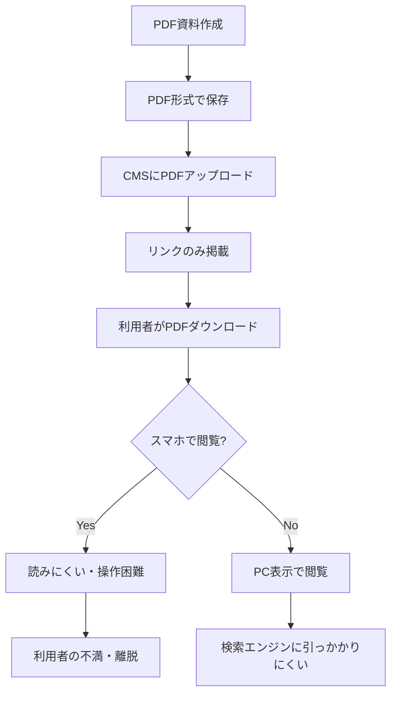
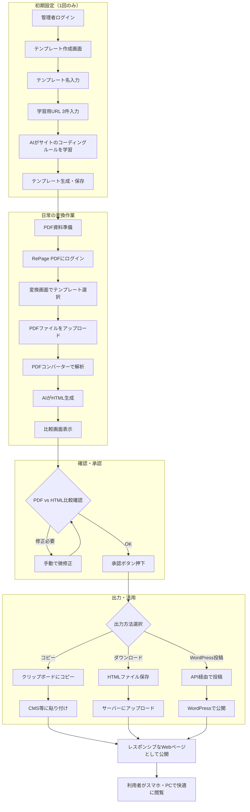
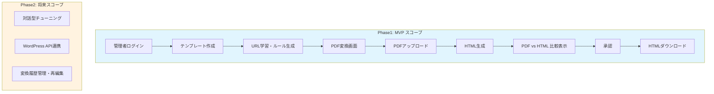
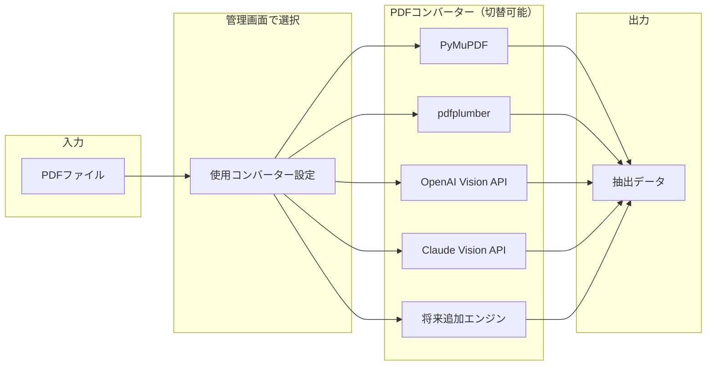

# 業務フロー図

## 概要
RePage PDFは、行政・公益サイトのPDFファイルをそのサイトのデザインに合ったHTMLコードに変換するAIシステムです。
本ドキュメントでは、現行のPDF公開業務と、RePage PDF導入後の業務フローを定義します。

## ステータス
- **フェーズ**: 要件定義
- **作成日**: 2025-12-12
- **更新日**: 2025-12-12
- **作成者**: Claude (AIPM)
- **レビュー状況**: 承認済み

---

## 内容

### 現行業務フロー (As-Is)

行政・公益サイトにおけるPDF公開の現状フロー

**現行フローの課題:**
- スマホでの閲覧性が悪い
- サイト内検索・Google検索でヒットしにくい
- JIS X 8341-3（アクセシビリティ）未対応
- HTML化は工数・予算的に困難

### 将来業務フロー (To-Be)

RePage PDF導入後の業務フロー

### MVP（Phase1）スコープのフロー

Phase1で実装する範囲を明示

### 関係者・役割

| 関係者 | 役割 | 責任範囲 |
|--------|------|----------|
| システム管理者 | PDFコンバーター設定、システム全体管理 | コンバーターの追加・切替、ユーザー管理 |
| 変換作業者（職員等） | PDF→HTML変換作業 | テンプレート選択、PDF変換、確認・承認 |
| 利用者（一般市民等） | 変換後Webページの閲覧 | ー（受益者） |

### PDFコンバーター切替アーキテクチャ

---

## 変更履歴
| 日付 | 版 | 変更内容 | 変更者 |
|------|-----|----------|--------|
| 2025-12-12 | 1.0 | 初版作成 | Claude (AIPM) |

---

## AIレビュー結果
<!-- レビュー実行後に自動追記されます -->
