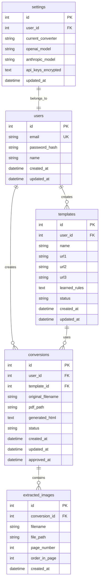
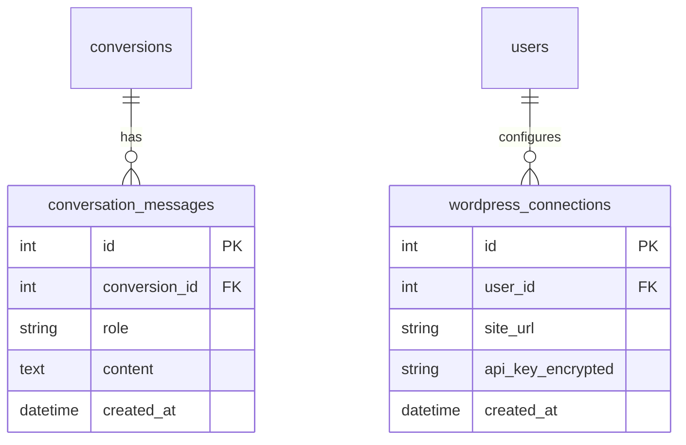

# ER図

## 概要
RePage PDFシステムのデータベース設計（エンティティ関連図）を定義します。
Phase1（MVP）に必要なテーブル構成とリレーションを示します。

## ステータス
- **フェーズ**: 基本設計
- **作成日**: 2025-12-13
- **更新日**: 2025-12-13
- **作成者**: Claude (AIPM)
- **レビュー状況**: 未着手

---

## 内容

### エンティティ一覧

| エンティティ名 | 説明 | 主キー |
|----------------|------|--------|
| users | システムユーザー（管理者） | id |
| templates | サイトテンプレート（学習ルール） | id |
| conversions | PDF変換履歴 | id |
| extracted_images | 抽出画像 | id |
| settings | ユーザー設定 | id |

### ER図（概念モデル）

### テーブル定義

#### 1. users（ユーザー）

| カラム名 | データ型 | NULL | デフォルト | 説明 |
|----------|----------|------|------------|------|
| id | INTEGER | NO | AUTO | 主キー |
| email | VARCHAR(255) | NO | - | メールアドレス（ユニーク） |
| password_hash | VARCHAR(255) | NO | - | パスワードハッシュ（bcrypt） |
| name | VARCHAR(100) | YES | NULL | 表示名 |
| created_at | DATETIME | NO | CURRENT_TIMESTAMP | 作成日時 |
| updated_at | DATETIME | NO | CURRENT_TIMESTAMP | 更新日時 |

**インデックス:**
- PRIMARY KEY (id)
- UNIQUE (email)

---

#### 2. templates（テンプレート）

| カラム名 | データ型 | NULL | デフォルト | 説明 |
|----------|----------|------|------------|------|
| id | INTEGER | NO | AUTO | 主キー |
| user_id | INTEGER | NO | - | 作成者ID（FK: users） |
| name | VARCHAR(200) | NO | - | テンプレート名 |
| url1 | VARCHAR(2000) | NO | - | 学習用URL 1 |
| url2 | VARCHAR(2000) | YES | NULL | 学習用URL 2 |
| url3 | VARCHAR(2000) | YES | NULL | 学習用URL 3 |
| learned_rules | TEXT | YES | NULL | 学習したルール（JSON） |
| status | VARCHAR(20) | NO | 'pending' | ステータス |
| created_at | DATETIME | NO | CURRENT_TIMESTAMP | 作成日時 |
| updated_at | DATETIME | NO | CURRENT_TIMESTAMP | 更新日時 |

**ステータス値:**
- `pending`: 作成直後（学習未実行）
- `learning`: 学習処理中
- `ready`: 学習完了（使用可能）
- `error`: 学習エラー

**インデックス:**
- PRIMARY KEY (id)
- INDEX (user_id)
- INDEX (status)

---

#### 3. conversions（変換）

| カラム名 | データ型 | NULL | デフォルト | 説明 |
|----------|----------|------|------------|------|
| id | INTEGER | NO | AUTO | 主キー |
| user_id | INTEGER | NO | - | 作成者ID（FK: users） |
| template_id | INTEGER | NO | - | テンプレートID（FK: templates） |
| original_filename | VARCHAR(255) | NO | - | 元のPDFファイル名 |
| pdf_path | VARCHAR(500) | NO | - | 保存PDF相対パス |
| generated_html | TEXT | YES | NULL | 生成されたHTML |
| status | VARCHAR(20) | NO | 'uploading' | ステータス |
| converter_used | VARCHAR(50) | YES | NULL | 使用したコンバーター |
| created_at | DATETIME | NO | CURRENT_TIMESTAMP | 作成日時 |
| updated_at | DATETIME | NO | CURRENT_TIMESTAMP | 更新日時 |
| approved_at | DATETIME | YES | NULL | 承認日時 |

**ステータス値:**
- `uploading`: アップロード中
- `uploaded`: アップロード完了
- `converting`: 変換処理中
- `converted`: 変換完了（レビュー待ち）
- `approved`: 承認済み
- `error`: エラー

**インデックス:**
- PRIMARY KEY (id)
- INDEX (user_id)
- INDEX (template_id)
- INDEX (status)
- INDEX (created_at)

---

#### 4. extracted_images（抽出画像）

| カラム名 | データ型 | NULL | デフォルト | 説明 |
|----------|----------|------|------------|------|
| id | INTEGER | NO | AUTO | 主キー |
| conversion_id | INTEGER | NO | - | 変換ID（FK: conversions） |
| filename | VARCHAR(255) | NO | - | 画像ファイル名 |
| file_path | VARCHAR(500) | NO | - | 保存画像相対パス |
| page_number | INTEGER | NO | - | PDFページ番号 |
| order_in_page | INTEGER | NO | 0 | ページ内の順序 |
| width | INTEGER | YES | NULL | 画像幅（px） |
| height | INTEGER | YES | NULL | 画像高さ（px） |
| created_at | DATETIME | NO | CURRENT_TIMESTAMP | 作成日時 |

**インデックス:**
- PRIMARY KEY (id)
- INDEX (conversion_id)
- INDEX (page_number)

---

#### 5. settings（設定）

| カラム名 | データ型 | NULL | デフォルト | 説明 |
|----------|----------|------|------------|------|
| id | INTEGER | NO | AUTO | 主キー |
| user_id | INTEGER | NO | - | ユーザーID（FK: users、ユニーク） |
| current_converter | VARCHAR(50) | NO | 'pymupdf' | 現在のコンバーター |
| openai_model | VARCHAR(50) | NO | 'gpt-4o-mini' | OpenAIモデル |
| anthropic_model | VARCHAR(50) | NO | 'claude-3-haiku-20240307' | Anthropicモデル |
| openai_api_key_enc | TEXT | YES | NULL | OpenAI APIキー（暗号化） |
| anthropic_api_key_enc | TEXT | YES | NULL | Anthropic APIキー（暗号化） |
| updated_at | DATETIME | NO | CURRENT_TIMESTAMP | 更新日時 |

**コンバーター値:**
- `pymupdf`
- `pdfplumber`
- `openai`
- `claude`

**OpenAIモデル値:**
- `gpt-4o-mini`（推奨・低コスト）
- `gpt-4o`（高精度）

**Anthropicモデル値:**
- `claude-3-haiku-20240307`（推奨・低コスト）
- `claude-3-5-sonnet-20241022`（高精度）

**インデックス:**
- PRIMARY KEY (id)
- UNIQUE (user_id)

---

### リレーション定義

| 親エンティティ | 子エンティティ | カーディナリティ | 外部キー | ON DELETE |
|----------------|----------------|------------------|----------|-----------|
| users | templates | 1:N | templates.user_id | CASCADE |
| users | conversions | 1:N | conversions.user_id | CASCADE |
| users | settings | 1:1 | settings.user_id | CASCADE |
| templates | conversions | 1:N | conversions.template_id | RESTRICT |
| conversions | extracted_images | 1:N | extracted_images.conversion_id | CASCADE |

---

### Phase2以降の追加テーブル（参考）

---

## 変更履歴
| 日付 | 版 | 変更内容 | 変更者 |
|------|-----|----------|--------|
| 2025-12-13 | 1.0 | 初版作成 | Claude (AIPM) |
| 2025-12-16 | 1.1 | settingsテーブルにopenai_model, anthropic_modelカラム追加 | Claude (AIPM) |

---

## AIレビュー結果

### レビュー日: 2025-12-16
### レビュアー: Claude (AIPM)
### 結果: **承認**

#### 確認項目

| 項目 | 結果 | 備考 |
|------|------|------|
| エンティティの網羅性 | OK | 5テーブル（users, templates, conversions, extracted_images, settings） |
| リレーションの妥当性 | OK | 外部キー制約、ON DELETE設定済み |
| カラム定義の明確性 | OK | データ型、NULL、デフォルト値明記 |
| settingsテーブルのモデル設定 | OK | openai_model, anthropic_model追加済み |
| Phase2拡張テーブルの分離 | OK | 参考として記載 |

#### 指摘事項
- なし
