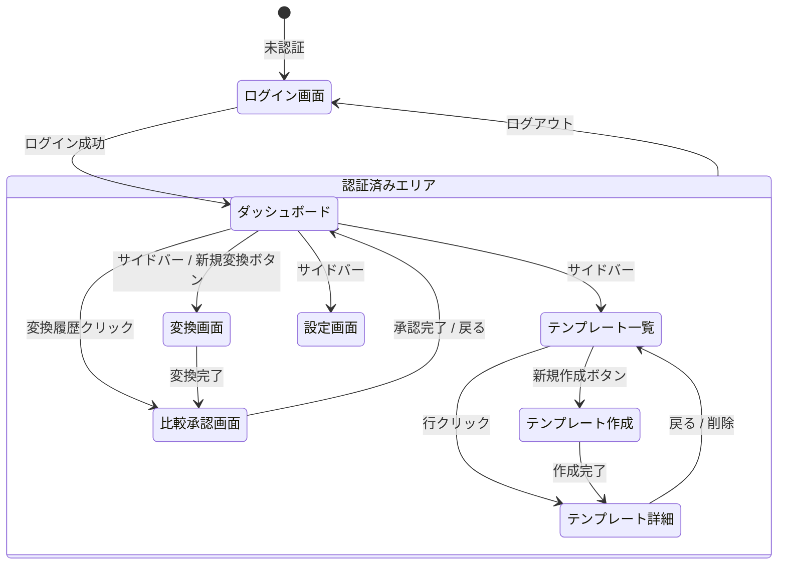

# 画面一覧・遷移図

## 概要
RePage PDFシステムのPhase1（MVP）における画面構成と画面遷移を定義します。
Notionライクな洗練されたモダンUIを目指します。

## ステータス
- **フェーズ**: 基本設計
- **作成日**: 2025-12-13
- **更新日**: 2025-12-13
- **作成者**: Claude (AIPM)
- **レビュー状況**: 未着手

---

## 内容

### 画面一覧

| 画面ID | 画面名 | URL | 認証 | 概要 |
|--------|--------|-----|------|------|
| SCR-001 | ログイン画面 | /login | 不要 | メール/パスワードでログイン |
| SCR-002 | ダッシュボード | / | 必要 | メイン画面、最近の変換一覧 |
| SCR-003 | テンプレート一覧 | /templates | 必要 | テンプレート管理 |
| SCR-004 | テンプレート作成 | /templates/new | 必要 | 新規テンプレート作成 |
| SCR-005 | テンプレート詳細 | /templates/{id} | 必要 | テンプレート情報・学習状況 |
| SCR-006 | 変換画面 | /convert | 必要 | PDF選択・変換実行 |
| SCR-007 | 比較・承認画面 | /convert/{id}/review | 必要 | PDF vs HTML比較・編集・承認 |
| SCR-008 | 設定画面 | /settings | 必要 | コンバーター・APIキー設定 |

---

### 画面遷移図



---

### 画面詳細

#### SCR-001: ログイン画面

```
┌─────────────────────────────────────────────────────────┐
│                                                         │
│                    RePage PDF                           │
│                                                         │
│              ┌───────────────────────┐                  │
│              │  メールアドレス       │                  │
│              └───────────────────────┘                  │
│              ┌───────────────────────┐                  │
│              │  パスワード           │                  │
│              └───────────────────────┘                  │
│              ┌───────────────────────┐                  │
│              │      ログイン         │                  │
│              └───────────────────────┘                  │
│                                                         │
└─────────────────────────────────────────────────────────┘
```

| 要素 | 説明 |
|------|------|
| ロゴ | RePage PDF ロゴ |
| メールアドレス入力 | バリデーション: 必須、メール形式 |
| パスワード入力 | バリデーション: 必須、8文字以上 |
| ログインボタン | POST /api/auth/login |

---

#### SCR-002: ダッシュボード

```
┌────────────┬────────────────────────────────────────────┐
│            │  ダッシュボード                  [👤 Admin]│
│  RePage    │────────────────────────────────────────────│
│  PDF       │                                            │
│            │  最近の変換                                │
│ ──────────│  ┌────────────────────────────────────┐   │
│ □ ダッシュ │  │ report.pdf → ○ 変換完了      12:30 │   │
│ □ テンプレ│  │ guide.pdf  → ● 承認済み      11:00 │   │
│ □ 変換    │  │ manual.pdf → ◐ 処理中        10:45 │   │
│ □ 設定    │  └────────────────────────────────────┘   │
│            │                                            │
│ ──────────│  クイックアクション                        │
│ [ログアウト] │  [📄 新規変換]  [📋 テンプレート作成]     │
│            │                                            │
└────────────┴────────────────────────────────────────────┘
```

| 要素 | 説明 |
|------|------|
| サイドバー | ナビゲーション（常時表示） |
| 最近の変換 | 直近5件の変換履歴 |
| クイックアクション | 新規変換、テンプレート作成へのショートカット |

---

#### SCR-003: テンプレート一覧

```
┌────────────┬────────────────────────────────────────────┐
│            │  テンプレート一覧        [+ 新規作成]      │
│  サイド    │────────────────────────────────────────────│
│  バー      │  ┌──────────────────────────────────────┐ │
│            │  │ 名前              状態      作成日   │ │
│            │  ├──────────────────────────────────────┤ │
│            │  │ 〇〇市公式サイト   ● Ready   12/10  │ │
│            │  │ △△財団サイト     ● Ready   12/08  │ │
│            │  │ □□センター       ◐ 学習中  12/12  │ │
│            │  └──────────────────────────────────────┘ │
│            │                                            │
└────────────┴────────────────────────────────────────────┘
```

| 要素 | 説明 |
|------|------|
| 新規作成ボタン | テンプレート作成画面へ |
| テンプレート一覧 | 名前、状態、作成日を表示 |
| 行クリック | テンプレート詳細へ遷移 |

---

#### SCR-004: テンプレート作成

```
┌────────────┬────────────────────────────────────────────┐
│            │  テンプレート作成                          │
│  サイド    │────────────────────────────────────────────│
│  バー      │                                            │
│            │  テンプレート名                            │
│            │  ┌────────────────────────────────────┐   │
│            │  │ 〇〇市公式サイト                   │   │
│            │  └────────────────────────────────────┘   │
│            │                                            │
│            │  学習用URL（3件まで）                      │
│            │  ┌────────────────────────────────────┐   │
│            │  │ https://example.city.lg.jp/page1   │   │
│            │  └────────────────────────────────────┘   │
│            │  ┌────────────────────────────────────┐   │
│            │  │ https://example.city.lg.jp/page2   │   │
│            │  └────────────────────────────────────┘   │
│            │  ┌────────────────────────────────────┐   │
│            │  │ https://example.city.lg.jp/page3   │   │
│            │  └────────────────────────────────────┘   │
│            │                                            │
│            │  [キャンセル]           [作成して学習開始] │
│            │                                            │
└────────────┴────────────────────────────────────────────┘
```

| 要素 | 説明 |
|------|------|
| テンプレート名 | 必須、200文字以内 |
| URL入力欄 | URL1は必須、URL2/3は任意 |
| 作成して学習開始 | POST /api/templates + 学習処理開始 |

---

#### SCR-006: 変換画面

```
┌────────────┬────────────────────────────────────────────┐
│            │  PDF変換                                   │
│  サイド    │────────────────────────────────────────────│
│  バー      │                                            │
│            │  1. テンプレートを選択                     │
│            │  ┌────────────────────────────────────┐   │
│            │  │ 〇〇市公式サイト              ▼   │   │
│            │  └────────────────────────────────────┘   │
│            │                                            │
│            │  2. PDFファイルをアップロード              │
│            │  ┌────────────────────────────────────┐   │
│            │  │                                    │   │
│            │  │    📄 ここにドラッグ＆ドロップ     │   │
│            │  │       または クリックして選択      │   │
│            │  │                                    │   │
│            │  └────────────────────────────────────┘   │
│            │  最大50MB、100ページまで                   │
│            │                                            │
│            │                        [変換開始]         │
│            │                                            │
└────────────┴────────────────────────────────────────────┘
```

| 要素 | 説明 |
|------|------|
| テンプレート選択 | Ready状態のテンプレートのみ表示 |
| ファイルアップロード | ドラッグ＆ドロップ対応 |
| 変換開始 | POST /api/conversions/upload → 変換処理 |

---

#### SCR-007: 比較・承認画面（メイン画面）

```
┌────────────┬─────────────────────┬─────────────────────┐
│            │  元PDF              │  生成HTML           │
│  サイド    │─────────────────────┼─────────────────────│
│  バー      │                     │                     │
│            │  ┌───────────────┐ │  ┌───────────────┐ │
│            │  │               │ │  │               │ │
│            │  │   PDFプレビュー│ │  │  HTMLプレビュー│ │
│            │  │               │ │  │               │ │
│            │  │   (スクロール)│ │  │   (スクロール)│ │
│            │  │               │ │  │               │ │
│            │  └───────────────┘ │  └───────────────┘ │
│            │                     │                     │
│            │  ページ: 1/10      │  [編集] [コード表示]│
│            │  [◀ 前] [次 ▶]    │                     │
│────────────┴─────────────────────┴─────────────────────│
│  [戻る]    [HTMLコピー] [ダウンロード]    [✓ 承認]    │
└───────────────────────────────────────────────────────┘
```

| 要素 | 説明 |
|------|------|
| 左ペイン | PDFプレビュー（ページ送り対応） |
| 右ペイン | HTMLプレビュー（リアルタイム表示） |
| 編集ボタン | HTMLコード編集モード切替 |
| コピーボタン | クリップボードにコピー |
| ダウンロード | .htmlファイルダウンロード |
| 承認ボタン | 変換結果を確定 |

---

#### SCR-008: 設定画面

```
┌────────────┬────────────────────────────────────────────┐
│            │  設定                                      │
│  サイド    │────────────────────────────────────────────│
│  バー      │                                            │
│            │  PDFコンバーター                           │
│            │  ┌────────────────────────────────────┐   │
│            │  │ ○ PyMuPDF（高速、推奨）            │   │
│            │  │ ○ pdfplumber（表抽出に強い）       │   │
│            │  │ ○ OpenAI Vision API                │   │
│            │  │ ○ Claude Vision API                │   │
│            │  └────────────────────────────────────┘   │
│            │                                            │
│            │  LLMモデル設定                             │
│            │  ⚠ Vision APIを使用する場合、Vision対応   │
│            │    モデルを選択してください                │
│            │                                            │
│            │  OpenAI モデル                             │
│            │  ┌────────────────────────────────────┐   │
│            │  │ gpt-4o-mini（推奨・低コスト）   ▼  │   │
│            │  └────────────────────────────────────┘   │
│            │  Anthropic モデル                          │
│            │  ┌────────────────────────────────────┐   │
│            │  │ claude-3-haiku（推奨・低コスト） ▼ │   │
│            │  └────────────────────────────────────┘   │
│            │                                            │
│            │  APIキー設定                               │
│            │  OpenAI API Key                            │
│            │  ┌────────────────────────────────────┐   │
│            │  │ sk-xxxx...xxxx                     │   │
│            │  └────────────────────────────────────┘   │
│            │  Anthropic API Key                         │
│            │  ┌────────────────────────────────────┐   │
│            │  │ sk-ant-xxxx...xxxx                 │   │
│            │  └────────────────────────────────────┘   │
│            │                                            │
│            │                              [保存]        │
│            │                                            │
└────────────┴────────────────────────────────────────────┘
```

| 要素 | 説明 |
|------|------|
| コンバーター選択 | ラジオボタン形式 |
| LLMモデル選択 | ドロップダウン形式 |
| APIキー入力 | マスク表示、保存時暗号化 |
| 保存ボタン | PUT /api/settings/converters + /models + /api-keys |

**LLMモデル選択肢:**

| API | 選択可能モデル | Vision対応 | 備考 |
|-----|---------------|-----------|------|
| OpenAI | gpt-4o-mini | ○ | 推奨（低コスト・高速） |
| OpenAI | gpt-4o | ○ | 高精度 |
| Anthropic | claude-3-haiku-20240307 | ○ | 推奨（低コスト・高速） |
| Anthropic | claude-3-5-sonnet-20241022 | ○ | 高精度 |

**注意事項:**
- PDFコンバーターで「OpenAI Vision API」または「Claude Vision API」を選択した場合、対応するLLMモデルはVision対応のものを選択してください
- 非Vision対応モデルを選択した場合、PDF画像解析機能が正常に動作しません

---

### 共通コンポーネント

| コンポーネント | 説明 |
|---------------|------|
| サイドバー | ナビゲーション、ロゴ、ログアウト |
| ヘッダー | ページタイトル、ユーザー情報 |
| トースト通知 | 成功/エラーメッセージ |
| ローディング | 処理中表示（スピナー + テキスト） |
| モーダル | 確認ダイアログ（削除時等） |

---

### デザインガイドライン

| 項目 | 仕様 |
|------|------|
| カラーパレット | 白基調、アクセント: #2F80ED（青）|
| フォント | Noto Sans JP / Inter |
| 角丸 | 8px（ボタン、カード） |
| シャドウ | 0 1px 3px rgba(0,0,0,0.1) |
| スペーシング | 8px単位のグリッド |

---

## 変更履歴
| 日付 | 版 | 変更内容 | 変更者 |
|------|-----|----------|--------|
| 2025-12-13 | 1.0 | 初版作成 | Claude (AIPM) |
| 2025-12-16 | 1.1 | SCR-008にLLMモデル設定機能を追加、Vision対応要件の注意書き追加 | Claude (AIPM) |

---

## AIレビュー結果

### レビュー日: 2025-12-16
### レビュアー: Claude (AIPM)
### 結果: **承認**

#### 確認項目

| 項目 | 結果 | 備考 |
|------|------|------|
| 画面数の妥当性 | OK | 8画面（SCR-001〜SCR-008） |
| 画面遷移の整合性 | OK | 認証フロー、メイン業務フロー網羅 |
| ワイヤーフレームの明確性 | OK | ASCII図で主要要素表現 |
| SCR-008 モデル設定 | OK | LLMモデル選択、Vision対応注記追加 |
| デザインガイドライン | OK | Notionライク、カラー/フォント明記 |
| 共通コンポーネント定義 | OK | サイドバー、ヘッダー、トースト等 |

#### 指摘事項
- なし
