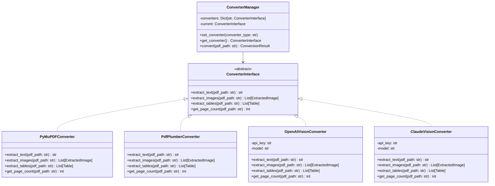

# クラス設計書

## 概要
RePage PDFシステムのバックエンド（Python/FastAPI）のクラス設計です。
レイヤードアーキテクチャに基づき、各層のクラス構成を定義します。

## ステータス
- **フェーズ**: 詳細設計
- **作成日**: 2025-12-16
- **更新日**: 2025-12-16
- **作成者**: Claude (AIPM)
- **レビュー状況**: 未着手

---

## 内容

### アーキテクチャ概要

```
┌─────────────────────────────────────────────────────────┐
│                    API Layer (FastAPI Router)           │
├─────────────────────────────────────────────────────────┤
│                    Service Layer                        │
├─────────────────────────────────────────────────────────┤
│                    Domain Layer (Models/Schemas)        │
├─────────────────────────────────────────────────────────┤
│                    Infrastructure Layer                 │
│              (DB/FileStorage/External API)              │
└─────────────────────────────────────────────────────────┘
```

---

### パッケージ構成

```
backend/
├── app/
│   ├── __init__.py
│   ├── main.py                 # FastAPIアプリケーション
│   ├── api/                    # APIルーター
│   │   ├── __init__.py
│   │   ├── deps.py             # 依存性注入
│   │   ├── auth.py             # 認証API
│   │   ├── templates.py        # テンプレートAPI
│   │   ├── conversions.py      # 変換API
│   │   └── settings.py         # 設定API
│   ├── core/                   # 設定・認証
│   │   ├── __init__.py
│   │   ├── config.py           # 環境設定
│   │   ├── security.py         # JWT/暗号化
│   │   └── exceptions.py       # カスタム例外
│   ├── models/                 # SQLAlchemyモデル
│   │   ├── __init__.py
│   │   ├── user.py
│   │   ├── template.py
│   │   ├── conversion.py
│   │   └── settings.py
│   ├── schemas/                # Pydanticスキーマ
│   │   ├── __init__.py
│   │   ├── user.py
│   │   ├── template.py
│   │   ├── conversion.py
│   │   └── settings.py
│   ├── services/               # ビジネスロジック
│   │   ├── __init__.py
│   │   ├── auth_service.py
│   │   ├── template_service.py
│   │   ├── conversion_service.py
│   │   └── learning_service.py
│   ├── converters/             # PDFコンバーター
│   │   ├── __init__.py
│   │   ├── base.py             # 抽象基底クラス
│   │   ├── pymupdf_converter.py
│   │   ├── pdfplumber_converter.py
│   │   ├── openai_converter.py
│   │   ├── claude_converter.py
│   │   └── manager.py          # コンバーター管理
│   └── infrastructure/         # インフラ層
│       ├── __init__.py
│       ├── database.py         # DB接続
│       ├── file_storage.py     # ファイル操作
│       └── external_api.py     # 外部API
└── requirements.txt
```

---

### クラス図

#### コンバーター（Strategy Pattern）



---

### クラス詳細

#### 1. コア層（core/）

##### config.py

```python
from pydantic_settings import BaseSettings

class Settings(BaseSettings):
    # Database
    DATABASE_URL: str = "sqlite:///./data/repage.db"

    # Storage
    STORAGE_PATH: str = "./storage"

    # JWT
    JWT_SECRET_KEY: str
    JWT_ALGORITHM: str = "HS256"
    JWT_EXPIRE_MINUTES: int = 1440

    # Converters
    DEFAULT_CONVERTER: str = "pymupdf"

    # LLM Models
    OPENAI_MODEL: str = "gpt-4o-mini"
    ANTHROPIC_MODEL: str = "claude-3-haiku-20240307"

    # API Keys
    OPENAI_API_KEY: str = ""
    ANTHROPIC_API_KEY: str = ""
    ENCRYPTION_KEY: str = ""

    class Config:
        env_file = ".env"
```

##### security.py

```python
from datetime import datetime, timedelta
from jose import jwt
from passlib.context import CryptContext
from cryptography.fernet import Fernet

class SecurityService:
    def __init__(self, settings: Settings):
        self.settings = settings
        self.pwd_context = CryptContext(schemes=["bcrypt"])
        self.fernet = Fernet(settings.ENCRYPTION_KEY)

    def hash_password(self, password: str) -> str:
        """パスワードをハッシュ化"""
        return self.pwd_context.hash(password)

    def verify_password(self, plain: str, hashed: str) -> bool:
        """パスワードを検証"""
        return self.pwd_context.verify(plain, hashed)

    def create_access_token(self, user_id: int) -> str:
        """JWTトークンを生成"""
        expire = datetime.utcnow() + timedelta(minutes=self.settings.JWT_EXPIRE_MINUTES)
        payload = {"sub": str(user_id), "exp": expire}
        return jwt.encode(payload, self.settings.JWT_SECRET_KEY, self.settings.JWT_ALGORITHM)

    def decode_token(self, token: str) -> int:
        """トークンをデコードしてuser_idを取得"""
        payload = jwt.decode(token, self.settings.JWT_SECRET_KEY, [self.settings.JWT_ALGORITHM])
        return int(payload["sub"])

    def encrypt_api_key(self, api_key: str) -> str:
        """APIキーを暗号化"""
        return self.fernet.encrypt(api_key.encode()).decode()

    def decrypt_api_key(self, encrypted: str) -> str:
        """APIキーを復号化"""
        return self.fernet.decrypt(encrypted.encode()).decode()
```

---

#### 2. モデル層（models/）

##### user.py

```python
from sqlalchemy import Column, Integer, String, DateTime
from sqlalchemy.orm import relationship
from datetime import datetime
from app.infrastructure.database import Base

class User(Base):
    __tablename__ = "users"

    id = Column(Integer, primary_key=True, autoincrement=True)
    email = Column(String(255), unique=True, nullable=False, index=True)
    password_hash = Column(String(255), nullable=False)
    name = Column(String(100))
    created_at = Column(DateTime, default=datetime.utcnow, nullable=False)
    updated_at = Column(DateTime, default=datetime.utcnow, onupdate=datetime.utcnow, nullable=False)

    # Relationships
    templates = relationship("Template", back_populates="user", cascade="all, delete-orphan")
    conversions = relationship("Conversion", back_populates="user", cascade="all, delete-orphan")
    settings = relationship("Settings", back_populates="user", uselist=False, cascade="all, delete-orphan")
```

##### template.py

```python
from sqlalchemy import Column, Integer, String, Text, DateTime, ForeignKey
from sqlalchemy.orm import relationship
from datetime import datetime
from app.infrastructure.database import Base

class Template(Base):
    __tablename__ = "templates"

    id = Column(Integer, primary_key=True, autoincrement=True)
    user_id = Column(Integer, ForeignKey("users.id", ondelete="CASCADE"), nullable=False)
    name = Column(String(200), nullable=False)
    url1 = Column(String(2000), nullable=False)
    url2 = Column(String(2000))
    url3 = Column(String(2000))
    learned_rules = Column(Text)  # JSON
    status = Column(String(20), default="pending", nullable=False)
    error_message = Column(Text)
    created_at = Column(DateTime, default=datetime.utcnow, nullable=False)
    updated_at = Column(DateTime, default=datetime.utcnow, onupdate=datetime.utcnow, nullable=False)

    # Relationships
    user = relationship("User", back_populates="templates")
    conversions = relationship("Conversion", back_populates="template")
```

---

#### 3. サービス層（services/）

##### template_service.py

```python
from typing import List, Optional
from sqlalchemy.orm import Session
from app.models.template import Template
from app.schemas.template import TemplateCreate, TemplateResponse

class TemplateService:
    def __init__(self, db: Session):
        self.db = db

    def create(self, user_id: int, data: TemplateCreate) -> Template:
        """テンプレートを作成"""
        template = Template(
            user_id=user_id,
            name=data.name,
            url1=data.url1,
            url2=data.url2,
            url3=data.url3,
            status="pending"
        )
        self.db.add(template)
        self.db.commit()
        self.db.refresh(template)
        return template

    def get_by_id(self, template_id: int, user_id: int) -> Optional[Template]:
        """IDでテンプレートを取得"""
        return self.db.query(Template).filter(
            Template.id == template_id,
            Template.user_id == user_id
        ).first()

    def get_list(self, user_id: int, status: Optional[str] = None) -> List[Template]:
        """テンプレート一覧を取得"""
        query = self.db.query(Template).filter(Template.user_id == user_id)
        if status:
            query = query.filter(Template.status == status)
        return query.order_by(Template.created_at.desc()).all()

    def delete(self, template_id: int, user_id: int) -> bool:
        """テンプレートを削除"""
        template = self.get_by_id(template_id, user_id)
        if template:
            self.db.delete(template)
            self.db.commit()
            return True
        return False
```

##### learning_service.py

```python
import asyncio
import json
from playwright.async_api import async_playwright
from app.models.template import Template
from app.infrastructure.external_api import LLMClient

class LearningService:
    def __init__(self, db: Session, llm_client: LLMClient):
        self.db = db
        self.llm_client = llm_client

    async def learn_from_urls(self, template: Template) -> dict:
        """URLからコーディングルールを学習"""
        template.status = "learning"
        self.db.commit()

        try:
            # URLからHTML取得
            urls = [template.url1, template.url2, template.url3]
            urls = [u for u in urls if u]

            html_contents = []
            for url in urls:
                html = await self._fetch_page(url)
                html_contents.append({"url": url, "html": html})

            # LLMでルール生成
            rules = await self._generate_rules(html_contents)

            template.learned_rules = json.dumps(rules, ensure_ascii=False)
            template.status = "ready"
            self.db.commit()

            return rules

        except Exception as e:
            template.status = "error"
            template.error_message = str(e)
            self.db.commit()
            raise

    async def _fetch_page(self, url: str) -> str:
        """Playwrightでページ取得"""
        async with async_playwright() as p:
            browser = await p.chromium.launch(headless=True)
            context = await browser.new_context(
                user_agent="Mozilla/5.0 (Windows NT 10.0; Win64; x64)...",
                viewport={"width": 1920, "height": 1080}
            )
            page = await context.new_page()
            await page.goto(url, wait_until="networkidle")
            await page.wait_for_timeout(2000)
            html = await page.content()
            await browser.close()
            return html

    async def _generate_rules(self, html_contents: list) -> dict:
        """LLMでコーディングルールを生成"""
        prompt = self._build_learning_prompt(html_contents)
        response = await self.llm_client.generate(prompt)
        return json.loads(response)
```

---

#### 4. コンバーター層（converters/）

##### base.py

```python
from abc import ABC, abstractmethod
from dataclasses import dataclass
from typing import List

@dataclass
class ExtractedImage:
    data: bytes
    page_number: int
    order_in_page: int
    width: int
    height: int
    mime_type: str

@dataclass
class Table:
    headers: List[str]
    rows: List[List[str]]
    page_number: int

@dataclass
class ConversionResult:
    text: str
    images: List[ExtractedImage]
    tables: List[Table]
    page_count: int

class ConverterInterface(ABC):
    @abstractmethod
    def extract_text(self, pdf_path: str) -> str:
        """PDFからテキストを抽出"""
        pass

    @abstractmethod
    def extract_images(self, pdf_path: str) -> List[ExtractedImage]:
        """PDFから画像を抽出"""
        pass

    @abstractmethod
    def extract_tables(self, pdf_path: str) -> List[Table]:
        """PDFから表を抽出"""
        pass

    @abstractmethod
    def get_page_count(self, pdf_path: str) -> int:
        """ページ数を取得"""
        pass

    def convert(self, pdf_path: str) -> ConversionResult:
        """PDF変換（テンプレートメソッド）"""
        return ConversionResult(
            text=self.extract_text(pdf_path),
            images=self.extract_images(pdf_path),
            tables=self.extract_tables(pdf_path),
            page_count=self.get_page_count(pdf_path)
        )
```

##### manager.py

```python
from typing import Dict
from app.converters.base import ConverterInterface, ConversionResult
from app.converters.pymupdf_converter import PyMuPDFConverter
from app.converters.pdfplumber_converter import PdfPlumberConverter
from app.converters.openai_converter import OpenAIVisionConverter
from app.converters.claude_converter import ClaudeVisionConverter

class ConverterManager:
    def __init__(self, settings):
        self.settings = settings
        self.converters: Dict[str, ConverterInterface] = {
            "pymupdf": PyMuPDFConverter(),
            "pdfplumber": PdfPlumberConverter(),
            "openai": OpenAIVisionConverter(
                api_key=settings.OPENAI_API_KEY,
                model=settings.OPENAI_MODEL
            ),
            "claude": ClaudeVisionConverter(
                api_key=settings.ANTHROPIC_API_KEY,
                model=settings.ANTHROPIC_MODEL
            )
        }
        self.current_type = settings.DEFAULT_CONVERTER

    def set_converter(self, converter_type: str):
        """使用するコンバーターを設定"""
        if converter_type not in self.converters:
            raise ValueError(f"Unknown converter: {converter_type}")
        self.current_type = converter_type

    def get_converter(self) -> ConverterInterface:
        """現在のコンバーターを取得"""
        return self.converters[self.current_type]

    def convert(self, pdf_path: str) -> ConversionResult:
        """PDF変換を実行"""
        return self.get_converter().convert(pdf_path)
```

---

#### 5. インフラ層（infrastructure/）

##### database.py

```python
from sqlalchemy import create_engine
from sqlalchemy.ext.declarative import declarative_base
from sqlalchemy.orm import sessionmaker
from app.core.config import settings

engine = create_engine(
    settings.DATABASE_URL,
    connect_args={"check_same_thread": False} if "sqlite" in settings.DATABASE_URL else {}
)
SessionLocal = sessionmaker(autocommit=False, autoflush=False, bind=engine)
Base = declarative_base()

def get_db():
    db = SessionLocal()
    try:
        yield db
    finally:
        db.close()
```

##### file_storage.py

```python
import os
import shutil
from pathlib import Path
from typing import Optional

class FileStorage:
    def __init__(self, base_path: str):
        self.base_path = Path(base_path)
        self.uploads_path = self.base_path / "uploads"
        self.images_path = self.base_path / "images"
        self.outputs_path = self.base_path / "outputs"

        # ディレクトリ作成
        for path in [self.uploads_path, self.images_path, self.outputs_path]:
            path.mkdir(parents=True, exist_ok=True)

    def save_pdf(self, conversion_id: int, filename: str, content: bytes) -> str:
        """PDFを保存"""
        path = self.uploads_path / str(conversion_id) / filename
        path.parent.mkdir(parents=True, exist_ok=True)
        path.write_bytes(content)
        return str(path.relative_to(self.base_path))

    def save_image(self, conversion_id: int, filename: str, content: bytes) -> str:
        """画像を保存"""
        path = self.images_path / str(conversion_id) / filename
        path.parent.mkdir(parents=True, exist_ok=True)
        path.write_bytes(content)
        return str(path.relative_to(self.base_path))

    def get_file(self, relative_path: str) -> Optional[bytes]:
        """ファイルを取得"""
        path = self.base_path / relative_path
        if path.exists():
            return path.read_bytes()
        return None

    def delete_conversion_files(self, conversion_id: int):
        """変換関連ファイルを削除"""
        for base in [self.uploads_path, self.images_path]:
            path = base / str(conversion_id)
            if path.exists():
                shutil.rmtree(path)
```

---

## 変更履歴
| 日付 | 版 | 変更内容 | 変更者 |
|------|-----|----------|--------|
| 2025-12-16 | 1.0 | 初版作成 | Claude (AIPM) |

---

## AIレビュー結果

### レビュー実施日: 2025-12-16

### レビュー結果: 合格

### 検出項目と対応:

| # | 項目 | 重要度 | 内容 | 対応 |
|---|------|--------|------|------|
| - | なし | - | 重大な問題なし | - |

### 確認事項:
- [x] レイヤードアーキテクチャが適切に設計されている
- [x] Strategyパターンでコンバーターが切り替え可能
- [x] SQLAlchemyモデルがデータベース設計書と整合している
- [x] Pydantic Settingsで環境変数管理が定義されている
- [x] セキュリティ（JWT、パスワードハッシュ、暗号化）が実装されている
- [x] Playwrightで動的ページ取得が実装されている
- [x] ファイルストレージの構成が明確

### 備考（Phase4での実装時に留意）:
- conversion.pyとsettings.pyのモデル詳細はデータベース設計書を参照
- external_api.py（LLMClient）の詳細実装はバッチ処理設計書を参照
