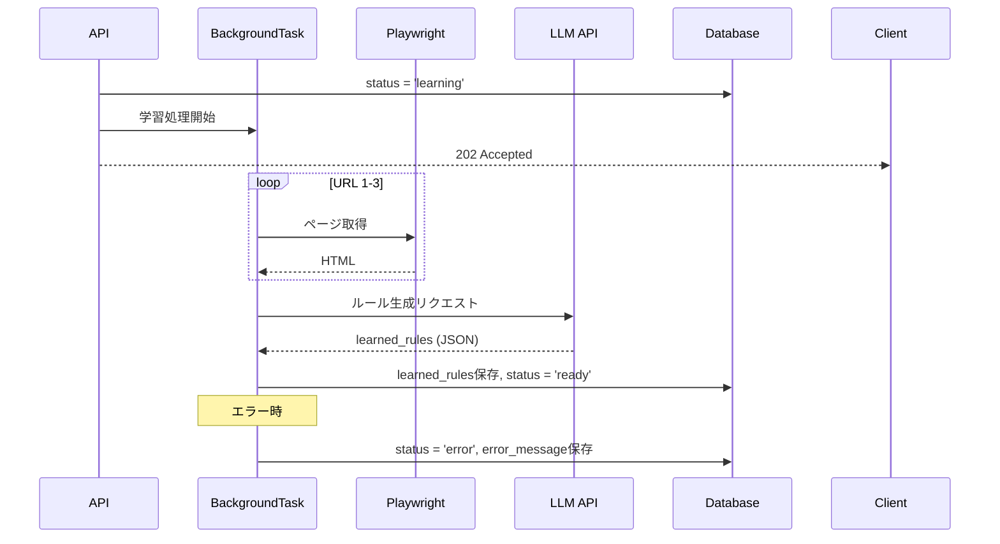
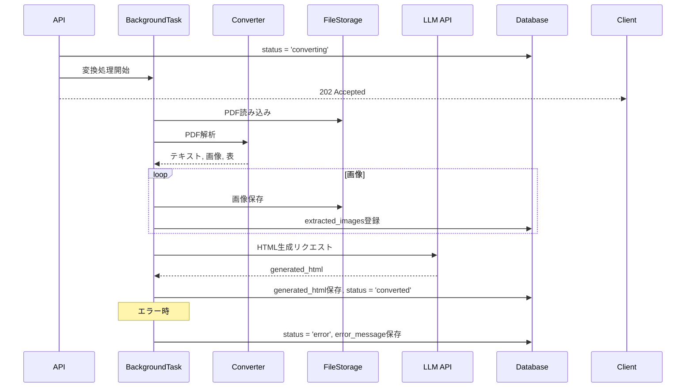

# バッチ処理設計書

## 概要
RePage PDFシステムのバッチ処理・非同期処理の詳細設計です。
URL学習処理、PDF変換処理、定期実行処理を定義します。

## ステータス
- **フェーズ**: 詳細設計
- **作成日**: 2025-12-16
- **更新日**: 2025-12-16
- **作成者**: Claude (AIPM)
- **レビュー状況**: 未着手

---

## 内容

### バッチ処理一覧

| バッチID | バッチ名 | 実行方式 | 実行タイミング | 概要 |
|---------|---------|---------|---------------|------|
| BAT-001 | URL学習処理 | 非同期（API起動） | API呼び出し時 | URLからコーディングルール学習 |
| BAT-002 | PDF変換処理 | 非同期（API起動） | API呼び出し時 | PDF→HTML変換 |
| BAT-003 | 古いファイル削除 | 定期実行（cron） | 毎日02:00 | 30日以上古いファイル削除 |
| BAT-004 | データベースバックアップ | 定期実行（cron） | 毎日03:00 | SQLiteファイルバックアップ |

---

### BAT-001: URL学習処理

#### 基本情報

| 項目 | 内容 |
|------|------|
| トリガー | POST /api/templates/{id}/learn |
| 実行方式 | 非同期（asyncio + BackgroundTasks） |
| タイムアウト | 180秒（URL取得60秒 × 3 + LLM処理） |
| リトライ | URL取得失敗時2回まで |

#### 処理フロー



#### 処理詳細

```python
async def process_learning(template_id: int, db: Session):
    """URL学習処理"""
    template = db.query(Template).get(template_id)

    try:
        # 1. URLからHTML取得（Playwright）
        urls = [template.url1, template.url2, template.url3]
        urls = [u for u in urls if u]

        html_contents = []
        for url in urls:
            html = await fetch_page_with_retry(url, max_retries=2)
            html_contents.append({
                "url": url,
                "html": html,
                "extracted_css": extract_stylesheets(html)
            })

        # 2. LLMでルール生成
        prompt = build_learning_prompt(html_contents)
        rules = await llm_client.generate(
            prompt=prompt,
            max_tokens=4000,
            temperature=0.3
        )

        # 3. 結果保存
        template.learned_rules = json.dumps(rules, ensure_ascii=False)
        template.status = "ready"
        db.commit()

    except Exception as e:
        template.status = "error"
        template.error_message = str(e)
        db.commit()
        logger.error(f"Learning failed for template {template_id}: {e}")
```

#### LLMプロンプト（学習用）

```
あなたはWebサイトのコーディングルールを分析するエキスパートです。
以下の3つのHTMLページを分析し、このサイトのコーディングルールをJSON形式で出力してください。

【分析対象】
{html_contents}

【出力形式】
{
  "site_name": "サイト名",
  "html_structure": {
    "article_wrapper": "セレクタ",
    "heading_classes": { "h1": "クラス名", "h2": "クラス名", ... },
    "paragraph_class": "クラス名",
    "list_class": "クラス名",
    "table_class": "クラス名"
  },
  "css_rules": ["CSSルール1", "CSSルール2", ...]
}
```

---

### BAT-002: PDF変換処理

#### 基本情報

| 項目 | 内容 |
|------|------|
| トリガー | POST /api/conversions/{id}/generate |
| 実行方式 | 非同期（asyncio + BackgroundTasks） |
| タイムアウト | 300秒（10ページPDFで約60秒想定） |
| リトライ | LLM API失敗時3回まで |

#### 処理フロー



#### 処理詳細

```python
async def process_conversion(conversion_id: int, db: Session):
    """PDF変換処理"""
    conversion = db.query(Conversion).get(conversion_id)
    template = conversion.template
    settings = db.query(Settings).filter_by(user_id=conversion.user_id).first()

    try:
        # 1. コンバーター選択・PDF解析
        converter = converter_manager.get_converter(settings.current_converter)
        result = converter.convert(conversion.pdf_path)

        # 2. 画像保存
        for img in result.images:
            filename = f"page{img.page_number}_{img.order_in_page}.{get_extension(img.mime_type)}"
            path = file_storage.save_image(conversion_id, filename, img.data)

            extracted_image = ExtractedImage(
                conversion_id=conversion_id,
                filename=filename,
                file_path=path,
                page_number=img.page_number,
                order_in_page=img.order_in_page,
                width=img.width,
                height=img.height,
                file_size=len(img.data),
                mime_type=img.mime_type
            )
            db.add(extracted_image)

        # 3. LLMでHTML生成
        learned_rules = json.loads(template.learned_rules)
        prompt = build_html_generation_prompt(
            content=result.text,
            tables=result.tables,
            rules=learned_rules
        )

        html = await llm_client.generate(
            prompt=prompt,
            max_tokens=8000,
            temperature=0.3
        )

        # 4. 結果保存
        conversion.generated_html = html
        conversion.converter_used = settings.current_converter
        conversion.page_count = result.page_count
        conversion.status = "converted"
        db.commit()

    except Exception as e:
        conversion.status = "error"
        conversion.error_message = str(e)
        db.commit()
        logger.error(f"Conversion failed for {conversion_id}: {e}")
```

#### LLMプロンプト（HTML生成用）

```
あなたはPDFコンテンツをHTMLに変換するエキスパートです。
以下のコーディングルールに従って、PDFから抽出したコンテンツをHTMLに変換してください。

【コーディングルール】
{learned_rules}

【PDFコンテンツ】
{extracted_content}

【表データ】
{tables}

【出力要件】
- ルールに記載されたクラス名を使用すること
- セマンティックなHTML5タグを使用すること
- 画像は {image_placeholder} で表現すること
- 表はHTMLテーブルで再現すること
```

---

### BAT-003: 古いファイル削除

#### 基本情報

| 項目 | 内容 |
|------|------|
| 実行方式 | cron（systemd timer） |
| 実行スケジュール | 毎日 02:00 |
| 対象 | 30日以上前の未承認変換データ |

#### 処理詳細

```python
def cleanup_old_files():
    """30日以上古い未承認ファイルを削除"""
    threshold = datetime.utcnow() - timedelta(days=30)

    # 古い未承認の変換を取得
    old_conversions = db.query(Conversion).filter(
        Conversion.status != "approved",
        Conversion.created_at < threshold
    ).all()

    for conversion in old_conversions:
        # ファイル削除
        file_storage.delete_conversion_files(conversion.id)

        # DB削除（CASCADE で extracted_images も削除）
        db.delete(conversion)

    db.commit()
    logger.info(f"Cleaned up {len(old_conversions)} old conversions")
```

#### systemd timer設定

```ini
# /etc/systemd/system/repage-cleanup.timer
[Unit]
Description=RePage PDF Cleanup Timer

[Timer]
OnCalendar=*-*-* 02:00:00
Persistent=true

[Install]
WantedBy=timers.target
```

```ini
# /etc/systemd/system/repage-cleanup.service
[Unit]
Description=RePage PDF Cleanup Service

[Service]
Type=oneshot
User=YOUR_USER
WorkingDirectory=/path/to/repage_pdf/backend
ExecStart=/path/to/venv/bin/python -m app.batch.cleanup
```

---

### BAT-004: データベースバックアップ

#### 基本情報

| 項目 | 内容 |
|------|------|
| 実行方式 | cron（systemd timer） |
| 実行スケジュール | 毎日 03:00 |
| 保持期間 | 7日間 |

#### 処理詳細

```bash
#!/bin/bash
# scripts/backup.sh

BACKUP_DIR="./backups"
DB_FILE="./data/repage.db"
DATE=$(date +%Y%m%d_%H%M%S)

# バックアップディレクトリ作成
mkdir -p "$BACKUP_DIR"

# SQLiteファイルコピー（排他ロック取得）
sqlite3 "$DB_FILE" ".backup '$BACKUP_DIR/repage_$DATE.db'"

# 圧縮
gzip "$BACKUP_DIR/repage_$DATE.db"

# 7日以上古いバックアップを削除
find "$BACKUP_DIR" -name "repage_*.db.gz" -mtime +7 -delete

echo "Backup completed: repage_$DATE.db.gz"
```

---

### エラーハンドリング

#### リトライ戦略

| 処理 | リトライ回数 | 間隔 | バックオフ |
|------|-------------|------|-----------|
| URL取得 | 2回 | 5秒 | 指数（5, 10秒） |
| LLM API | 3回 | 10秒 | 指数（10, 20, 40秒） |

#### エラー通知（将来実装）

```python
async def notify_error(batch_name: str, error: Exception, context: dict):
    """エラー発生時の通知（Phase2以降）"""
    # Slack/メール通知など
    pass
```

---

### ログ設計

| ログレベル | 出力内容 |
|-----------|---------|
| INFO | 処理開始/完了、件数 |
| WARNING | リトライ発生 |
| ERROR | 処理失敗（スタックトレース含む） |

```python
# ログ設定
logging.config.dictConfig({
    "version": 1,
    "handlers": {
        "file": {
            "class": "logging.handlers.RotatingFileHandler",
            "filename": "logs/batch.log",
            "maxBytes": 10485760,  # 10MB
            "backupCount": 5
        }
    },
    "loggers": {
        "app.batch": {
            "level": "INFO",
            "handlers": ["file"]
        }
    }
})
```

---

## 変更履歴
| 日付 | 版 | 変更内容 | 変更者 |
|------|-----|----------|--------|
| 2025-12-16 | 1.0 | 初版作成 | Claude (AIPM) |

---

## AIレビュー結果

### レビュー実施日: 2025-12-16

### レビュー結果: 合格

### 検出項目と対応:

| # | 項目 | 重要度 | 内容 | 対応 |
|---|------|--------|------|------|
| - | なし | - | 重大な問題なし | - |

### 確認事項:
- [x] 全4バッチ処理が定義されている
- [x] シーケンス図で処理フローが明確
- [x] 非同期処理（BackgroundTasks）の実装が定義されている
- [x] LLMプロンプトが定義されている
- [x] リトライ戦略が定義されている
- [x] systemd timer設定が記載されている
- [x] ログ設計が定義されている
- [x] クラス設計書のLearningService、ConverterManagerと整合している
